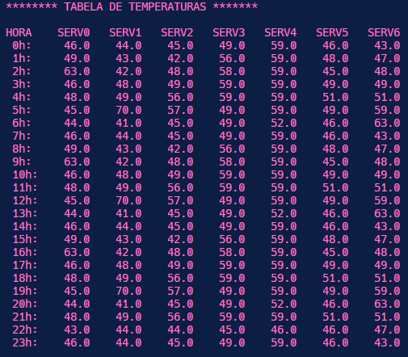
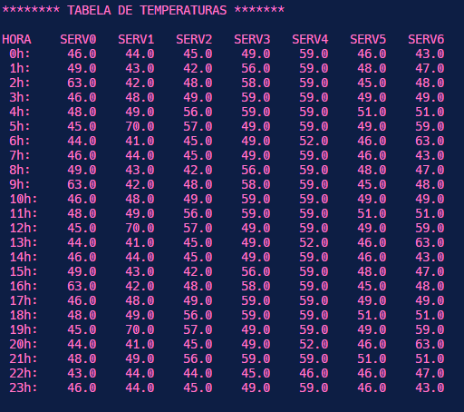
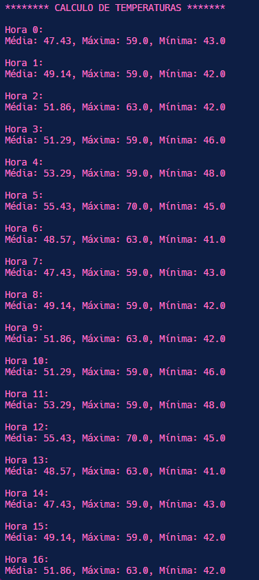
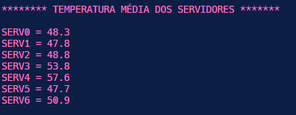
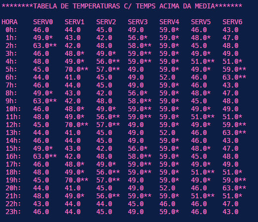

## Cálculo e Visualização de Dados de Temperatura dos Servidores

Este foi um trabalho do começo do meu segundo período da faculdade, gostei bastante do resultado! O programa calcula e visualiza dados de temperatura coletados de servidores ao longo de um dia em C. O código realiza as seguintes tarefas:

- **Cálculo de Estatísticas de Temperatura por Hora:**
  - Calcula temperatura média, máxima e mínima para cada hora do dia.
  - Leva em consideração dados de seis servidores.

- **Armazenamento das Temperaturas Médias por Servidor:**
  - Armazena temperaturas médias de cada servidor em um vetor chamado "tempServMedia".
  - Facilita análises individuais de cada servidor.

- **Visualização de Dados em Tabela Formatada:**
  - Gera tabela formatada com indicações visuais de desvios em relação à média:
    - Um asterisco (*) indica temperatura acima da média.
    - Dois asteriscos (**) indicam temperatura mais de 3 graus acima da média.

- **Identificação da Maior Diferença entre Temperatura e Média:**
  - Identifica a hora do dia com a maior diferença entre temperatura e média.
  - Fornece insights sobre momentos de variação significativa.

**Objetivo:**
- Analisar detalhadamente as temperaturas dos servidores ao longo de um dia.
- Demonstração das habilidades de cálculo e formatação de dados em C.

